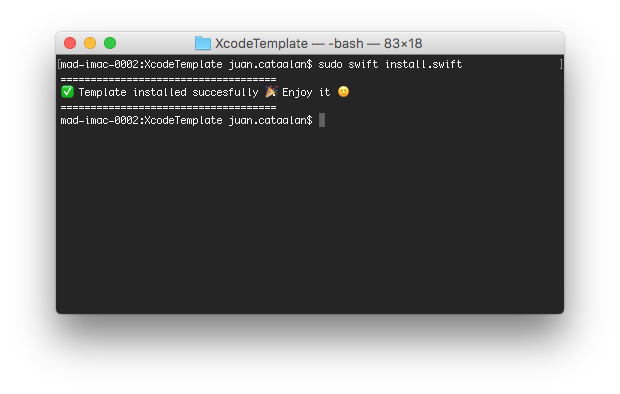

## How to install

### Using script (easy)
Only need execute this command in terminal:
```swift
swift install.swift
```
You should be this output message:



If all it's ok you now could find your template in Xcode.

### Manual
Go to Application folder, browse to the Xcode application icon. Right-click it and choose 'Show Package Contents'. Then browse to:
`Contents/Developer/Platforms/iPhoneOS.platform/Developer/Library/Xcode/Templates/Project Templates/iOS/Application` and add "Module MVP.xctemplate" file. Now you can find your template in Xcode.

## Easy to use


## Generated code
This template generates all files that you need to create a new MVP module. All generated code is Swift 5.

This is an example, we're creating a Login module:

- [Login module](/assets/default.md)


## MVP diagram overview

